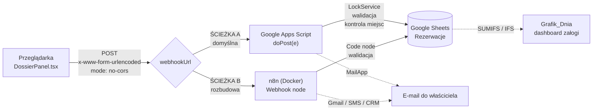

# Warstwa automatyzacji — system rezerwacji

Architektura **zero-cost**: cały tor od kliknięcia na stronie po wiersz
w arkuszu nie generuje ani złotówki kosztów stałych. Żadnej bazy danych,
żadnego serwera aplikacyjnego, żadnej subskrypcji.

```
automatyzacje/
├── apps-script/
│   ├── Kod.gs               ← backend zapisu (doPost) + inicjalizacja arkusza
│   └── appsscript.json      ← manifest: zakresy OAuth, tryb Web App
├── google-sheets/
│   └── FORMULY.md           ← mapa kolumn, SUMIFS, IFS, formatowanie warunkowe
├── n8n/
│   └── workflow-rezerwacje.json  ← gotowy przepływ do zaimportowania
└── README.md                ← ten plik
```

---

## 1. Przepływ danych



**Frontend nie wie, która ścieżka jest podpięta.** Wysyła ten sam payload pod
adres z `companyConfig.bookingConfig.webhookUrl`. Przełączenie A ↔ B to
podmiana jednego stringa (albo zmiennej `VITE_BOOKING_WEBHOOK_URL` w Vercelu)
i redeploy — zero zmian w kodzie komponentu.

---

## 2. Którą ścieżkę wybrać

| | **A — Apps Script** | **B — n8n** |
|---|---|---|
| Koszt | 0 zł, hosting Google | 0 zł, ale wymaga działającego Dockera 24/7 |
| Czas wdrożenia | ~10 minut | ~30 minut (poświadczenia OAuth) |
| Dostępność | SLA Google | tyle, ile działa Twój kontener |
| **CORS** | brak `doOptions` → front **musi** użyć `no-cors` | pełne nagłówki CORS → front **może czytać odpowiedź** |
| Kontrola przepełnienia | ✅ czyta arkusz przed zapisem, `LockService` | ❌ zapis „w ciemno" (chyba że dołożysz węzeł odczytu) |
| Powiadomienia | e-mail (`MailApp`, limit 100/dobę) | e-mail, SMS, Slack, Telegram, WhatsApp… |
| Integracje CRM | trzeba dopisać ręcznie | 400+ gotowych węzłów |
| Rozgałęzianie logiki | kod w `Kod.gs` | wizualnie, bez kodu |

**Rekomendacja: zacznij od A.** Apps Script jest dziś podpięty w konfiguracji
i obsługuje komplet wymagań, w tym jedyną rzecz, której n8n „z pudełka" nie
robi — **atomową kontrolę przepełnienia rejsu**.

Po ścieżkę B sięgnij, gdy pojawi się **konkretna** potrzeba: SMS-y do klientów,
karta w CRM, przypomnienie dzień przed rejsem, raport tygodniowy. Wtedy
najczystszy układ to **A + B równolegle**: Apps Script dalej zapisuje
i pilnuje miejsc, a `Kod.gs` dodatkowo woła webhook n8n (`UrlFetchApp.fetch`),
który zajmuje się resztą świata.

---

## 3. Wdrożenie ścieżki A (Apps Script)

```
1.  Otwórz arkusz → Rozszerzenia → Apps Script
2.  Wklej całą zawartość apps-script/Kod.gs jako Kod.gs
3.  Uruchom funkcję `inicjalizujArkusz`  → zaakceptuj zgody OAuth
        (tworzy zakładki, formaty kolumn, formuły, zakresy nazwane)
4.  Uruchom funkcję `testDoPost`         → sprawdź, czy wiersz się dopisał
5.  Wdróż → Nowe wdrożenie → Aplikacja internetowa
        Wykonaj jako:   Ja (właściciel arkusza)
        Kto ma dostęp:  Wszyscy
6.  Skopiuj adres /exec → companyConfig.bookingConfig.webhookUrl
```

Test wdrożenia z terminala (bez frontendu):

```bash
curl -L -X POST "https://script.google.com/macros/s/TWOJE_ID/exec" -d "unitType=SZYBKA MOTORÓWKA RIB&date=2026-08-25&timeSlot=13:00&seatsCount=2&clientName=Test Curl&clientPhone=509562635&source=CURL"
```

Flaga `-L` jest **obowiązkowa** — Apps Script odpowiada przekierowaniem 302 na
`script.googleusercontent.com`; bez `-L` zobaczysz pustą odpowiedź i uznasz,
że nie działa.

Health-check wdrożenia:

```bash
curl -L "https://script.google.com/macros/s/TWOJE_ID/exec?akcja=zdrowie"
```

> ⚠️ **Najczęstszy błąd wdrożeniowy:** zapisanie pliku w edytorze Apps Script
> **niczego nie publikuje**. Po każdej zmianie kodu:
> *Wdróż → Zarządzaj wdrożeniami → ikona ołówka → Wersja: **Nowa** → Wdróż*.
> Adres `/exec` zostaje ten sam, zmienia się tylko wersja pod spodem.

---

## 4. Wdrożenie ścieżki B (n8n)

```bash
docker compose up -d
```

Panel: <http://localhost:5678>

```
1.  Workflows → ⋯ → Import from File → n8n/workflow-rezerwacje.json
2.  Credentials → New → Google Sheets OAuth2 API → autoryzuj konto
3.  Otwórz węzeł „Zapisz w Google Sheets" → wskaż utworzone poświadczenia
4.  (opcjonalnie) Credentials → Gmail OAuth2 → odblokuj węzeł
        „Powiadom zaloge (Gmail)" (po imporcie jest wyłączony)
5.  Kliknij „Active" w prawym górnym rogu
6.  Skopiuj Production URL z węzła Webhook
        → companyConfig.bookingConfig.webhookUrl
```

Węzły przepływu:

| Węzeł | Rola |
|---|---|
| `Webhook rezerwacji` | POST `/webhook/rezerwacje`, `allowedOrigins: *` — prawdziwy CORS |
| `Normalizuj i waliduj` | Code (JS): aliasy pól, normalizacja daty/godziny/telefonu, walidacja, generowanie ID |
| `Dane poprawne?` | IF — rozgałęzienie na zapis albo odpowiedź 400 |
| `Zapisz w Google Sheets` | append do zakładki `Rezerwacje`, mapowanie automatyczne po nazwach kolumn |
| `Powiadom zaloge (Gmail)` | e-mail do właściciela (**domyślnie wyłączony**) |
| `Odpowiedz OK` / `Odpowiedz BLAD` | `respondToWebhook` — 200 albo 400 z listą błędów |

Klucz do automatycznego mapowania: węzeł Code zwraca obiekt o kluczach
**identycznych z nagłówkami kolumn** (`ID`, `DataWpisu`, `DataRejsu`, …).
Dzięki temu `mappingMode: autoMapInputData` trafia wszystko bez ręcznej
konfiguracji, a dołożenie kolumny w arkuszu wymaga tylko dopisania pola
w węźle Code.

### ⚠️ Zanim wystawisz n8n do internetu

`WEBHOOK_URL=http://localhost:5678/` w `docker-compose.yml` działa **tylko
lokalnie**. Strona na Vercelu nie dosięgnie `localhost` na Twoim komputerze.
Do produkcji potrzebujesz publicznego adresu HTTPS — tunelu (Cloudflare Tunnel,
ngrok) albo VPS-a — i zmiany `WEBHOOK_URL` oraz `N8N_HOST` na tę domenę.
Ustaw wtedy również `allowedOrigins` na konkretną domenę zamiast `*`.

---

## 5. Bezpieczeństwo — co ten układ ma, a czego nie ma

| Ryzyko | Stan |
|---|---|
| Wyciek klucza API do arkusza | ✅ niemożliwy — przeglądarka nigdy nie dostaje poświadczeń Google |
| Zapis śmieciowych danych | ✅ walidacja serwerowa (format daty, godziny, telefonu, zakres miejsc, horyzont 120 dni) |
| Przepełnienie rejsu przy równoczesnych zapisach | ✅ `LockService` + odczyt-przed-zapisem (ścieżka A) |
| Spam botów w formularzu | ⚠️ **brak ochrony** — endpoint jest publiczny z założenia |
| Podszycie się pod cudzą rezerwację | ⚠️ brak — potwierdzenie jest telefoniczne, to świadomy wybór modelu |

**Jeśli pojawi się spam**, kolejność środków od najtańszego:

1. *honeypot* — ukryte pole w formularzu; wypełnione = bot, odrzuć po cichu,
2. limit czasowy — odrzuć zgłoszenie wysłane szybciej niż 3 s po otwarciu kroku 4,
3. `KONFIG.sekret` w `Kod.gs` **plus** pośrednictwo n8n (sekret zostaje na
   serwerze; w kodzie przeglądarki żaden sekret nie jest sekretem),
4. Cloudflare Turnstile przed wysyłką.

**RODO:** przez ten tor idą dane osobowe (imię, nazwisko, telefon).
Administratorem jest klient, podstawą prawną art. 6 ust. 1 lit. b RODO
(czynności zmierzające do zawarcia umowy). Google jest podmiotem
przetwarzającym — potrzebna jest umowa powierzenia (Google Workspace ma ją
w warunkach) i wpis w polityce prywatności. Klauzula informacyjna jest
wyświetlana w kroku 4 formularza.
